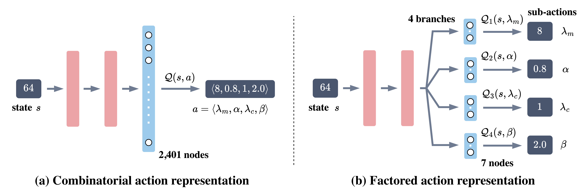

<h1>
    <p align="center"> Multi-parameter Control for the Genetic Algorithm on OneMax </p>
</h1>

## 🗒️ Table of Contents

- [Introduction](#introduction)
- [Repository Structure](#repository-structure)
- [Installation](#installation)
- [Quickstart](#quickstart)

## 💡 Introduction


In this repository, we are developing two types of deep Q-Network (DQN) architectures: combinatorial and factored action space representation. These architectures are designed to train a multi-parameter control policy that can dynamically control four parameters of (1+($\lambda$, $\lambda$))-GA, which is an optimization algorithm for the OneMax problem.

We extend the [DACBench](https://github.com/automl/DACBench) package by introducing the (1+($\lambda$, $\lambda$))-GA algorithm on the OneMax problem. See [README](dacbench/README.md).

## 🎯 Repository Structure

Outline the structure of repository.

```plaintext
OneMax-MPDAC/
├── notebooks/                     
│   └── test.ipynb                  # Testing on-the-fly using trained DDQNs
├── resources/                      # Additional resources for this project
│   ├── ddqn_ckpts                  # Contains DDQNs checkpoints for all problem sizes
│   ├── other_methods               # Contains the policies and runtimes of irace-based tuning and other methods
├── dacbench/                       # Source code for the DACBench.
├── onemax_mpdac/                   # Source code for the project
│   ├── train.py                    # Script to train models
│   ├── eval.py                     # Contains functions to evaluate the policy
│   ├── models                      # Two fashions of DDQN used for training
│   │   ├── combinatorial_ddqn.py   # Combinatorial action space
│   │   └── factored_ddqn.py        # Factored action space
│   ├── derive_mp_policy.py         # Contains functions to derive new multi-parameter control policy
├── requirements.txt                # List of dependencies
├── README.md                       # Project readme file
└── LICENSE                         # License for the project
```

## ⚙️ Installation

To re-produce this project, you will need to have the following dependencies installed:
- Ubuntu 18.04.6 LTS
- [Miniconda](https://docs.conda.io/en/latest/miniconda.html)
- Python 3.10
- [PyTorch](https://pytorch.org/) (version 2.0 or later)

After installing Miniconda, you can create a new environment and install the required packages using the following commands:

```bash
conda create -n onemaxmpdac python=3.10
conda activate onemaxmpdac
```
For installing `torch`, refer this link: [INSTALLING PREVIOUS VERSIONS OF PYTORCH](https://pytorch.org/get-started/previous-versions/)

then clone and install dependencies:
```bash
pip install -r requirements.txt
````
## 🚀 Quickstart
### Testing
We provide the best checkpoints of DDQNs, which are trained using the best settings of reward functions in certain problem sizes at `resources/ddqn_ckpts`.

To replicate the results reported in the paper, follow the notebook [test.ipynb](notebooks/test.ipynb):
1. Initialize the DDQN and OneMax environment objects.
2. Load the trained checkpoint properly.
3. Run (1+($\lambda$, $\lambda$))-GA and observe the ERT.

**Note**: Please make sure you have the notebook kernel installed with the necessary packages.

### Training
We divide our experiments into two groups:
- Combinatorial action space
- Factored action space

The implementation of these families of DDQN can be found in [models](onemax_mpdac/models).

### Experiment with the combinatorial action space

```bash
python onemax_mpdac/train.py    \   ## Main Python script for training
    --out-dir outputs         \   ## Set output directory
    --config-file onemax_mpdac/configs/onemax_n100_cmp.yml \    ## For problem size of 100 and don't use the reward shifting
    --gamma 0.9998                \   ## Set the value of discount factor
    --seed 1 \                  ## Set random seed
    --n-cpus 4                  ## Set number of CPUs for parallel processing
```

### Experiment with the factored action space

```bash
python onemax_mpdac/train.py    \   ## Main Python script for training
    --out-dir outputs         \   ## Set output directory
    --config-file onemax_mpdac/configs/onemax_n100_fmp.yml \    ## For problem size of 100 and don't use the reward shifting
    --gamma 0.9998                \   ## Set the value of discount factor
    --seed 1 \                  ## Set random seed
    --n-cpus 4                  ## Set number of CPUs for parallel processing
```

**Note**: In case you'd like to use reward shifting mechanism, simply replace the configuration file by adding `as` at the end, for instance: `onemax_n100_cmp_as.yml`. 

### Derive multi-parameter control policy

```bash
python onemax_mpdac/derive_mp_policy.py    \
    --n 10000   \   ## Indicate the tested problem size
    --type lbd1_alpha_lbd2  \   ## Set of parameters controlled by the proposed symbolic functions
    --is-discrete   \   ## Discretize the population size's choices following a pre-defined portfolio
```

**Note**: the policy and runtime should be found at `outputs/discrete_derived_policies/n10000#lbd1_alpha_lbd2.pth`. Concerning the arguments, the `lbd1` denotes the offspring population size of mutation phase, `alpha` represents the mutation rate coefficient, and `lbd2` represents for the offspring population size of crossover phase.

### Logs

During the process, we can monitor the logs by following the path `outputs/<date>/<config-file-name>/gamma:<value>/<time>_seed_<#>`. In this directory:

```plaintext
outputs/<date>/<config-file-name>/gamma:<value>/<time>_seed_<#>/
├── <config-file-name>.yml          # Training configuration is stored here
├── train_args.json                 # Additional configuration during the training 
├── eval/                           
|   ├── best_model.pt               # best checkpoint of the trained model
|   ├── evaluation.npz              # policies and expected runtimes during the evaluation
|   ├── evaluation_last.npz         # top-k best policies are used for testing after finishing the training
|   ├── Policy Comparison.png       # the best policy line chart of 4 parameters across DDQN and theory-derived theory
|   └── runtimes_logs_cpus:<#n_cpus>.json   # training time logs
```