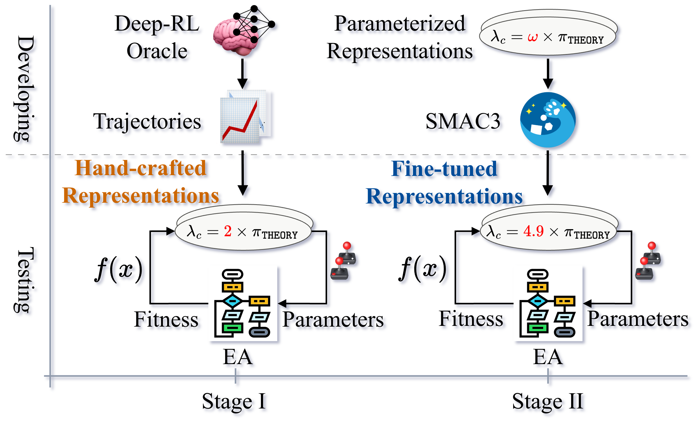

<h1>
    <p align="center"> Discovering Interpretable Multi-Parameter Control Policies for Evolutionary Algorithms Using Deep Reinforcement Learning </p>
</h1>

## 🗒️ Table of Contents

- [Introduction](#introduction)
- [Repository Structure](#repository-structure)
- [Installation](#installation)
- [Quickstart](#quickstart)

## 💡 Introduction


This repository accompanies the paper *"Discovering Interpretable Multi-Parameter Control Policies for Evolutionary Algorithms Using Deep Reinforcement Learning"* (IEEE Transactions on Evolutionary Computation).

**Motivation.** While deep reinforcement learning (deep-RL) has emerged as a state-of-the-art methodology for Dynamic Algorithm Configuration (DAC), rigorous theoretical analysis of parameter control remains largely restricted to single-parameter settings. Transitioning from single- to multi-parameter control is non-trivial: the combinatorial action space grows exponentially, standard RL approaches often fail to converge, and the resulting neural-network policies are uninterpretable black boxes.

**This work.** We address these challenges using the $(1+(\lambda,\lambda))$-GA optimizing OneMax as a representative case study — one of the few problems where a super-constant speedup of dynamic control over any static choice has been formally proven. We make the following contributions:

- **Algorithm-agnostic enhancements.** We identify three key ingredients for effective multi-parameter RL in this combinatorial DAC setting: (i) *factored action-space decomposition*, which decouples the four parameters $(\lambda_m, \alpha, \lambda_c, \beta)$ into independent branches; (ii) *adaptive reward shifting*, which mitigates under-exploration; and (iii) *long-horizon discounting*, which prevents underestimation of future rewards. Their combination consistently yields the best performance.

- **DDQN vs. PPO.** We conduct a comprehensive comparison of Double Deep Q-Networks (DDQN) and Proximal Policy Optimization (PPO). Despite PPO's general reputation for stability, it suffers from policy collapse in this DAC environment — collapsing to a degenerate policy of $\lambda_m = 1$ regardless of the reward shaping or architecture used. DDQN successfully navigates this challenge and produces high-quality behavioral trajectories suitable for downstream analysis.

- **Two-stage symbolic policy discovery.** We distill the learned DDQN behaviors into an explicit, interpretable symbolic control policy through a two-stage process. In Stage I, we derive hand-crafted equations informed by the RL trajectories. In Stage II, we refine these equations via the automated configurator SMAC3, yielding a fine-tuned policy that surpasses the hand-crafted formulation by 6.8%. The resulting symbolic policy outperforms all existing baselines — including IRACE-based multi-parameter tuning — across problem sizes up to $n = 40{,}000$, while remaining mathematically tractable for running time analysis.

The environment is built on top of [DACBench](https://github.com/automl/DACBench). See [dacbench/](dacbench/) for details on the extended $(1+(\lambda,\lambda))$-GA benchmark.

## 🎯 Repository Structure

Outline the structure of repository.

```plaintext
OneMax-MPDAC/
├── assets/                             # Figures used in this README
│   ├── interpretable_rl4dac.png        # Two-stage distillation framework (Fig. 1 in paper)
│   └── action_spaces.png               # Combinatorial vs. factored network architectures (Fig. 2)
├── notebooks/
│   └── test.ipynb                      # Interactive notebook: load a checkpoint and observe ERT
├── resources/
│   ├── ddqn_ckpts/                     # Best DDQN checkpoints (factored, AS, γ=0.9998)
│   │   └── onemax_n{100,200,500,1000,1500,2000}_fmp_as_09998.pt
│   └── runtimes/
│       └── comparison_method_runtimes.json  # Pre-computed ERTs for all baselines
├── dacbench/                           # Extended DACBench environment
│   ├── benchmarks/
│   │   └── theory_benchmark.py         # Benchmark wrapper for the (1+(λ,λ))-GA
│   ├── envs/
│   │   ├── theory.py                   # Full 4-parameter (1+(λ,λ))-GA environment
│   │   ├── ablation_l1_theory.py       # Ablation: control λm only
│   │   ├── ablation_l1c_theory.py      # Ablation: control λm + α
│   │   ├── ablation_l1l2_theory.py     # Ablation: control λm + λc
│   │   ├── ablation_l1l2c_theory.py    # Ablation: control λm + α + λc
│   │   ├── ablation_l1l2m_theory.py    # Ablation: control λm + λc + β
│   │   ├── ablation_l1m_theory.py      # Ablation: control λm + β
│   │   ├── ablation_l1mc_theory.py     # Ablation: control λm + α + β
│   │   ├── ablation_ppo.py             # Environment variant used for PPO experiments
│   │   └── policies/theory/            # Theory-derived policy (πTHEORY) implementation
│   ├── instance_sets/
│   │   └── ollga_theory/               # Problem instance CSVs for n ∈ {50…40000}
│   ├── run_baselines.py                # Script to run and record baseline policy runtimes
│   └── wrappers/                       # Gym wrappers (action tracking, observation, reward noise, …)
├── onemax_mpdac/                       # Main project source
│   ├── comb_ddqn.py                    # Combinatorial DDQN (2401-output Q-network)
│   ├── fact_ddqn.py                    # Factored DDQN (4-branch action-branching network)
│   ├── train_ddqn.py                   # Training script for DDQN (combinatorial & factored)
│   ├── train_comb_ppo.py               # Training script for PPO with combinatorial action space
│   ├── train_fact_ppo.py               # Training script for PPO with factored action space
│   ├── eval.py                         # Evaluation utilities (run policy, compute ERT)
│   ├── derive_mp_policy.py             # Stage I: hand-craft symbolic multi-parameter policy
│   ├── tune_derive_mp_policy.py        # Stage II: fine-tune symbolic policy via SMAC3
│   ├── loggers.py                      # TensorBoard / WandB logging helpers
│   ├── utils.py                        # Shared utilities
│   └── configs/
│       ├── onemax_n{N}_cmp[_as].yml    # DDQN combinatorial configs (N ∈ {100…2000}, optional AS)
│       ├── onemax_n{N}_fmp[_as][_l1*].yml  # DDQN factored configs (with ablation variants)
│       ├── onemax_n{N}_sp_l1[_as].yml  # Single-parameter DDQN configs
│       ├── onemax_n{N}_mp_ppo[_l1*].yml    # Multi-parameter PPO configs (factored & ablation)
│       ├── onemax_n{N}_sp_ppo.yml      # Single-parameter PPO configs
│       ├── ablation_ppo/               # PPO reward-shifting ablation configs (b ∈ {0,−1,…,−7})
│       ├── search_space/               # SMAC3 hyperparameter search space definitions
│       └── target_function/            # SMAC3 target algorithm wrapper configs
├── scripts/
│   └── run.sh                          # Convenience shell script for launching experiments
├── requirements.txt
├── README.md
└── LICENSE
```

**Config naming conventions:**
- `cmp` / `fmp` — combinatorial / factored action space representation
- `sp` / `mp` — single-parameter / multi-parameter control
- `as` — adaptive reward shifting enabled
- `l1`, `l1c`, `l1l2`, `l1l2c`, `l1l2m`, `l1m`, `l1mc` — parameter subsets used in ablation study (Section VI of paper): `l1`=λm, `l2`=λc, `c`=α, `m`=β

## ⚙️ Installation

To re-produce this project, you will need to have the following dependencies installed:
- Ubuntu 18.04.6 LTS
- [Miniconda](https://docs.conda.io/en/latest/miniconda.html)
- Python 3.10
- [PyTorch](https://pytorch.org/) (version 2.0 or later)

After installing Miniconda, you can create a new environment and install the required packages using the following commands:

```bash
conda create -n onemaxmpdac python=3.10
conda activate onemaxmpdac
```
For installing `torch`, refer this link: [INSTALLING PREVIOUS VERSIONS OF PYTORCH](https://pytorch.org/get-started/previous-versions/)

then clone and install dependencies:
```bash
pip install -r requirements.txt
````
## 🚀 Quickstart
### Testing
We provide the best checkpoints of DDQNs, which are trained using the best settings of: {factored representation, adaptive reward shifting, `discount_factor=0.9998` } in certain problem sizes at `resources/ddqn_ckpts`.

To replicate the results reported in the paper, follow the notebook [test.ipynb](notebooks/test.ipynb):
1. Initialize the DDQN and OneMax environment objects.
2. Load the trained checkpoint properly.
3. Run (1+($\lambda$, $\lambda$))-GA and observe the ERT.

**Note**: Please make sure you have the notebook kernel installed with the necessary packages.

### Baseline and Comparison

We compare our deep-RL multi-parameter control policies against the following baselines:

- $\pi_{\text{THEORY}}$: theory-derived single-parameter control policy [Doerr & Doerr, 2015/2018], where $\lambda_m = \sqrt{n/(n-f(x))}$
- **IRACE**: multi-parameter control policy tuned by IRACE [Dang & Doerr, 2019]
- **ONE-FIFTH**: single-parameter control policy based on the one-fifth success rule
- $\pi_{\text{DDQN/sp}}$: single-parameter DDQN policy (controls $\lambda_m$ only) with adaptive reward shifting
- $\pi_{\text{PPO/mp}}$: multi-parameter PPO with factored action space (naïve and fixed-shift reward)
- $\pi_{\text{DDQN/mp}}$: **our best policy** — multi-parameter DDQN with factored action space and adaptive reward shifting

The table below reports normalized ERT (ERT/$n$, lower is better, std in parentheses) across 1,000 runs per problem size. Bold marks the best result.

| Method | Parameter | Reward | $n=1{,}000$ | $n=1{,}500$ | $n=2{,}000$ |
|--------|-----------|--------|-------------|-------------|-------------|
| $\pi_{\text{THEORY}}$ | — | — | 6.587 (0.53) | 6.647 (0.44) | 6.681 (0.39) |
| IRACE | — | — | 5.587 (0.35) | 5.621 (0.29) | 5.666 (0.26) |
| ONE-FIFTH | — | — | 6.886 (0.54) | 6.931 (0.48) | 7.008 (0.41) |
| DDQN | Single | AS | 6.338 (0.55) | 6.209 (0.41) | 6.608 (0.41) |
| PPO | Multi/Fact | Naïve | 7.544 (1.39) | 7.938 (1.50) | 8.294 (1.44) |
| PPO | Multi/Fact | FS ($b{=}{-7}$) | 7.016 (0.60) | 7.940 (1.45) | 8.267 (1.42) |
| **DDQN** | **Multi/Fact** | **AS** | **5.397 (0.41)** | **4.971 (0.29)** | **5.162 (0.29)** |

DDQN with factored action space and adaptive reward shifting ($\pi_{\text{DDQN/mp}}$) consistently outperforms all baselines, including the strongest IRACE-based approach that also tunes all four parameters of the $(1+(\lambda,\lambda))$-GA. PPO with factored action space suffers from policy collapse in this DAC setting, failing to converge to a meaningful policy regardless of the reward shifting strategy applied.

Detail of baselines and pre-computed runtimes, please check [resources/README.md](./resources/README.md).

### Training
We divide our experiments into two groups:
- Combinatorial action space
- Factored action space

The implementation of these families of DDQN can be found in [models](onemax_mpdac/models).

#### Experiment with the combinatorial action space

```bash
python onemax_mpdac/train_ddqn.py    \   ## Main Python script for training
    --out-dir outputs         \   ## Set output directory
    --config-file onemax_mpdac/configs/onemax_n100_cmp.yml \    ## For problem size of 100 and don't use the reward shifting
    --gamma 0.9998                \   ## Set the value of discount factor
    --seed 1 \                  ## Set random seed
    --n-cpus 4                  ## Set number of CPUs for parallel processing
```

#### Experiment with the factored action space

```bash
python onemax_mpdac/train_ddqn.py    \   ## Main Python script for training
    --out-dir outputs         \   ## Set output directory
    --config-file onemax_mpdac/configs/onemax_n100_fmp.yml \    ## For problem size of 100 and don't use the reward shifting
    --gamma 0.9998                \   ## Set the value of discount factor
    --seed 1 \                  ## Set random seed
    --n-cpus 4                  ## Set number of CPUs for parallel processing
```

**Note**: In case you'd like to use reward shifting mechanism, simply replace the configuration file by adding `as` at the end, for instance: `onemax_n100_cmp_as.yml`. 

## Tune multi-parameter control policy

This corresponds to **Stage II** of the symbolic policy discovery pipeline: the hand-crafted equations (Eqs. 11–13 in the paper) are re-parameterized with four free variables — `lbd1_breaking_point` (κm), `lbd2_amplified_factor` (ω), `alpha_breaking_point` (κα), and `alpha_abyss` (υ) — and optimized via SMAC3 using a multi-fidelity Hyperband strategy. The incumbent is saved to `outputs/smac3/<timestamp>.json`.

```bash
python onemax_mpdac/tune_derive_mp_policy.py    \
    --problem-sizes 200 500 1000 2000   \   ## Problem sizes used as the SMAC3 objective (default: 100 500)
    --total-budget 1000000              \   ## Total fidelity budget for SMAC3 (default: 1e6)
    --total-cpus 20                         ## CPUs for parallel evaluation (default: all available)
```

The search space matches Table VI in the paper:

| Parameter | Variable | Search space | Hand-crafted default |
|-----------|----------|--------------|----------------------|
| Switching point for λm | `lbd1_breaking_point` (κm) | [0.5, 1.0) | 0.95 |
| Amplification factor for λc | `lbd2_amplified_factor` (ω) | [1.0, 5.0] | 2.0 |
| Switching point for α | `alpha_breaking_point` (κα) | [0.5, 1.0) | 0.95 |
| Lower bound for α | `alpha_abyss` (υ) | [0.001, 0.1] | 0.001 |

**Output**: the best configuration and its normalized ERT cost are written to `outputs/smac3/<timestamp>.json`.

### Logs

During the process, we can monitor the logs by following the path `outputs/<date>/<config-file-name>/gamma:<value>/<time>_seed_<#>`. In this directory:

```plaintext
outputs/<date>/<config-file-name>/gamma:<value>/<time>_seed_<#>/
├── <config-file-name>.yml          # Training configuration is stored here
├── train_args.json                 # Additional configuration during the training 
├── eval/                           
|   ├── best_model.pt               # best checkpoint of the trained model
|   ├── evaluation.npz              # policies and expected runtimes during the evaluation
|   ├── evaluation_last.npz         # top-k best policies are used for testing after finishing the training
|   ├── Policy Comparison.png       # the best policy line chart of 4 parameters across DDQN and theory-derived theory
|   └── runtimes_logs_cpus:<#n_cpus>.json   # training time logs
```